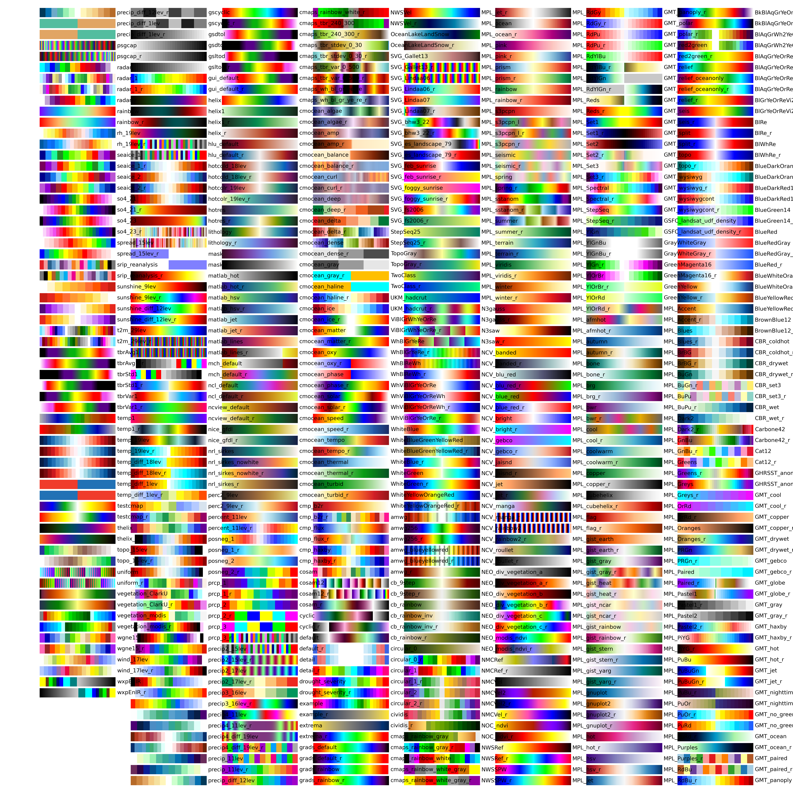

# cmaps

> [!NOTE]
> This project is forked from [hhuangwx/cmaps](https://github.com/hhuangwx/cmaps)

Make it easier to use user defined colormaps in matplotlib. Default colormaps are from [NCL](http://www.ncl.ucar.edu/Document/Graphics/color_table_gallery.shtml) website.

Users can define an environmental variable `CMAPS_FILE_DIR` pointing to the folder containing the self-defined RGB colormaps.



## Installation

This project has not yet uploaded to PyPI or Anaconda. Installing from source is required.

```bash
pip install git+https://github.com/jshn9515/cmaps.git
```

## Usage

Import the library:

```python
import cmaps
```

Get a particular colormap:

```python
cmap = cmaps.get_cmap('posneg_1')
```

If you want to change the colormap's order or interpolate the colormap, use the following keyword arguments:

```python
interpolated_cmap = cmaps.get_cmap('posneg_1', lutsize=128)
reversed_cmap = cmaps.get_cmap('posneg_1', reverse=True)
```

Get all the available colormaps:

```python
cmap_names = cmaps.get_cmap_list()
```

Plot a particular colormap:

```python
cmap.plot_cmap('posneg_1')
```

`plot_cmap` function also accepts `lutsize` and `reverse` keyword argument.

## Special Features

1. "slicing" function like lists or numpy ndarrays is supported for colormaps:

    ```python
    cmap = cmaps.get_cmap('posneg_1')
    cmap[20:-20:2]
    cmap[-20:20:-2]
    ```

2. "add" function for the colormaps are supported:

    ```python
    cmap1 = cmaps.get_cmap('posneg_1')
    cmap2 = cmaps.get_cmap('posneg_2')
    cmap = cmap1 + cmap2
    ```

3. "multiply" function is also supported, for repeating itself `num` times:

    ```python
    cmap = cmaps.get_cmap('posneg_1')
    multiplied_cmap = cmap * 3
    ```

4. A colormap can also be interpolated (different from the "resampled" function in the new version of matplotlib which only takes the nearest ones):

    ```python
    cmap = cmaps.get_cmap('posneg_1')
    interpolated_cmap = cmap.interp(50)
    ```

5. `plot_cmap()`, `to_list()` and `to_numpy()` functions are also supported:

    ```python
    cmap = cmaps.get_cmap('posneg_1')
    cmap.plot_cmap()
    cmap.to_list()
    cmap.to_numpy()
    ```

6. A colormap can be converted to `LinearSegmentedColormap` with different numbers of colors, with part of effect similar to interpolation:

    ```python
    cmap = cmaps.get_cmap('posneg_1')
    segmented_cmap = cmap.to_segment(N=100)
    ```

    
